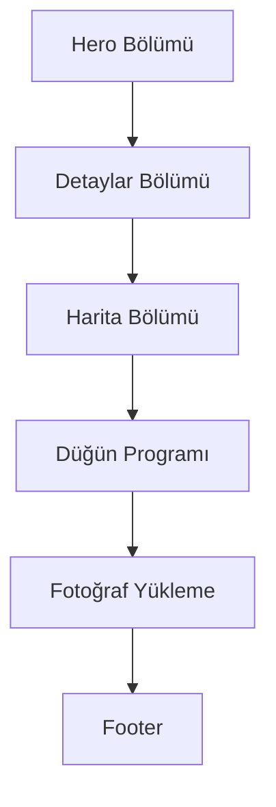

## 1. Ürün Genel Bakış
Türkçe tek sayfalık düğün davetiyesi web sitesi. Çiftin isimleri ve düğün detaylarını paylaşan, fotoğraf yükleme özelliği olan minimal, zarif bir davetiye sitesi.

## 2. Temel Özellikler

### 2.2 Özellik Modülü
Düğün davetiyesi web sitesi aşağıdaki ana bölümlerden oluşur:
1. **Hero Bölümü**: Çiftin isimleri ve davet metni
2. **Detaylar Bölümü**: Tarih, saat, mekan adı ve adresi
3. **Harita Bölümü**: Google Maps embed ve konum açma butonu
4. **Düğün Programı**: Saat saat timeline listesi
5. **Fotoğraf Yükleme**: Google Form embed ve form açma butonu
6. **Footer**: Teşekkür metni

### 2.3 Sayfa Detayları
| Sayfa Adı | Modül Adı | Özellik Açıklaması |
|-----------|-------------|---------------------|
| Ana Sayfa | Hero Bölümü | Çift isimlerini ve davet metnini göster |
| Ana Sayfa | Detaylar Bölümü | Düğün tarihi, saati, mekan adı ve adres bilgilerini göster |
| Ana Sayfa | Harita Bölümü | Google Maps iframe embed ve "Konumu Aç" butonu ile yönlendirme |
| Ana Sayfa | Düğün Programı | Saat saat düğün akışını timeline formatında listele |
| Ana Sayfa | Fotoğraf Yükleme | Google Form iframe embed ve alternatif "Formu Aç" butonu |
| Ana Sayfa | Footer | Teşekkür mesajı ve kapanış metni |
| Ana Sayfa | Navigasyon | Smooth scroll ile çalışan anchor linkli mini menü |

## 3. Temel Süreç
Kullanıcı akışı:
1. Ziyaretçi siteye girer
2. Hero bölümünde çiftin isimlerini ve davet metnini okur
3. Detaylar bölümünde düğün bilgilerini görür
4. Harita bölümünden mekanı inceleyebilir ve konumu açabilir
5. Düğün programını timeline olarak görüntüler
6. Fotoğraf yüklemek için Google Form'u kullanabilir
7. Footer'da teşekkür mesajını okur

## 4. Kullanıcı Arayüzü Tasarımı

### 4.1 Tasarım Stili
- **Renk Paleti**: Pastel düğün renkleri (gül kurusu, şampanya, bej, beyaz)
- **Tipografi**: Zarif serif fontlar başlıklar için, sans-serif içerikler için
- **Buton Stili**: Yuvarlak köşeler, pastel renkler, hover efektleri
- **Düzen Stili: Mobil öncelikli, tek sütun layout, bol boşluk kullanımı
- **İkon Stili: Minimal çizgi ikonlar, düğün temalı semboller

### 4.2 Sayfa Tasarımı Genel Bakış
| Sayfa Adı | Modül Adı | UI Öğeleri |
|-----------|-------------|-------------|
| Ana Sayfa | Hero Bölümü | Büyük başlık, zarif yazı tipi, pastel arka plan, minimal süslemeler |
| Ana Sayfa | Detaylar Bölümü | Kart tabanlı düzen, ikonlarla desteklenmiş bilgi kutuları |
| Ana Sayfa | Harita Bölümü | Responsive Google Maps iframe, konum butonu |
| Ana Sayfa | Düğün Programı | Dikey timeline, saat ve etkinlik bilgileri |
| Ana Sayfa | Fotoğraf Yükleme | Google Form iframe, alternatif buton, açıklama metni |
| Ana Sayfa | Navigasyon | Sticky mini menü, smooth scroll anchor linkler |

### 4.3 Responsive Tasarım
- Mobil öncelikli tasarım yaklaşımı
- Tablet ve desktop görünümleri için genişletilmiş layout
- Dokunmatik ekran optimizasyonu
- Hızlı yükleme süreleri için optimize edilmiş görseller