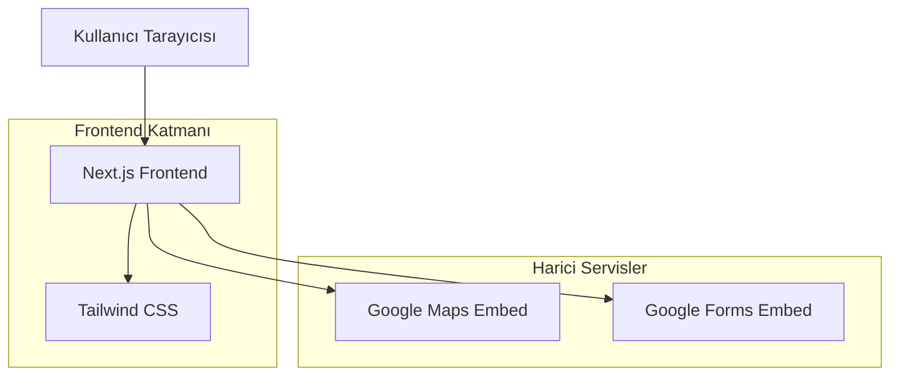

## 1. Mimar Tasarımı



## 2. Teknoloji Açıklaması
- Frontend: Next.js 14 App Router + React 18
- Stil: Tailwind CSS 3
- Initialization Tool: create-next-app
- Backend: Yok (tamamen statik)
- Hosting: Vercel

## 3. Route Tanımlamaları
| Route | Amaç |
|-------|---------|
| / | Ana sayfa, tüm içerik tek sayfada |

## 4. Çevresel Değişkenler ve Konfigürasyon
- `NEXT_PUBLIC_GOOGLE_MAPS_URL`: Google Maps embed URL'i
- `NEXT_PUBLIC_GOOGLE_FORM_URL`: Google Form embed URL'i
- `NEXT_PUBLIC_COUPLE_NAMES`: Çift isimleri
- `NEXT_PUBLIC_WEDDING_DATE`: Düğün tarihi
- `NEXT_PUBLIC_WEDDING_VENUE`: Düğün mekanı
- `NEXT_PUBLIC_WEDDING_ADDRESS`: Mekan adresi

## 5. Bileşen Yapısı

### 5.1 Ana Bileşenler
- `HeroSection`: Çift isimleri ve davet metni
- `DetailsSection`: Tarih, saat, mekan bilgileri
- `MapSection`: Google Maps embed
- `TimelineSection`: Düğün programı timeline'ı
- `PhotoUploadSection`: Google Form embed
- `FooterSection`: Teşekkür metni
- `Navigation`: Smooth scroll menü

### 5.2 Yardımcı Bileşenler
- `Container`: İçerik hizalama wrapper'ı
- `Section`: Bölüm wrapper'ı
- `Button`: Özel buton bileşeni
- `TimelineItem`: Timeline öğesi

## 6. Kurulum Adımları

### 6.1 Geliştirme Ortamı
```bash
npx create-next-app@latest wedding-invitation --typescript --tailwind --app

cd wedding-invitation
```

### 6.2 Ortam Değişkenleri
`.env.local` dosyası oluştur:
```
NEXT_PUBLIC_GOOGLE_MAPS_URL="https://maps.google.com/maps?q=mekan_adresi&output=embed"
NEXT_PUBLIC_GOOGLE_FORM_URL="https://docs.google.com/forms/d/e/form_id/viewform"
NEXT_PUBLIC_COUPLE_NAMES="Ayşe & Mehmet"
NEXT_PUBLIC_WEDDING_DATE="15 Temmuz 2024"
NEXT_PUBLIC_WEDDING_VENUE="Lüks Düğün Salonu"
NEXT_PUBLIC_WEDDING_ADDRESS="Atatürk Cd. No:123, İstanbul"
```

### 6.3 Geliştirme Sunucusu
```bash
npm run dev
```

## 7. Vercel Deploy

### 7.1 Vercel CLI ile Deploy
```bash
npm i -g vercel
vercel
```

### 7.2 GitHub Entegrasyonu
1. GitHub reposu oluştur
2. Vercel dashboard'dan yeni proje ekle
3. GitHub reposunu bağla
4. Ortam değişkenlerini ekle
5. Deploy'u tetikle

### 7.3 Manuel Deploy
```bash
npm run build
npm run start
```

## 8. Performans Optimizasyonları
- Next.js Image optimizasyonu
- Tailwind CSS purging
- Font optimizasyonu
- Static generation
- Lazy loading for embeds